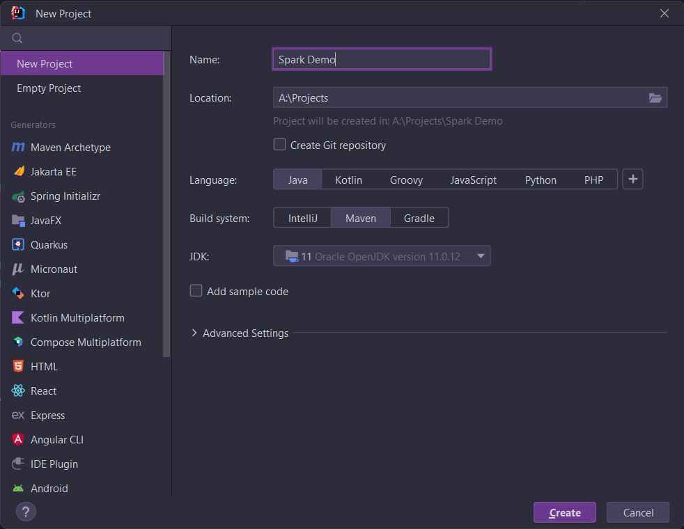

# Configuration of IDE
Follow the below step to set up your favorite IDE to work with apache spark.
Open up your favorite IDE like (VS code, IntelliJ, etc). My choice is IntelliJ.
## Create new Project with maven.

### Add dependencies
add the following dependencies block to pom.xml file
~~~
<dependencies>
        <dependency>
            <groupId>org.apache.spark</groupId>
            <artifactId>spark-core_2.13</artifactId>
            <version>3.3.0</version>
        </dependency>
        <dependency> <!-- Spark dependency -->
            <groupId>org.apache.spark</groupId>
            <artifactId>spark-sql_2.13</artifactId>
            <version>3.3.0</version>
        </dependency>
</dependencies>
~~~
#### congratulation you are good to go start writing your code.