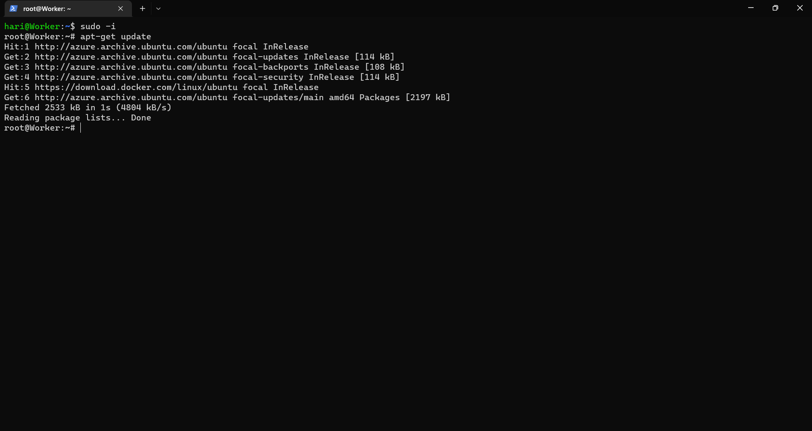
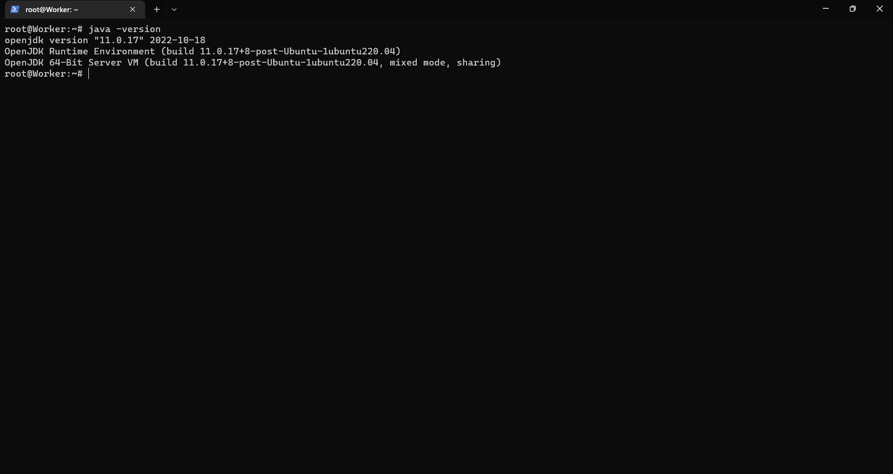
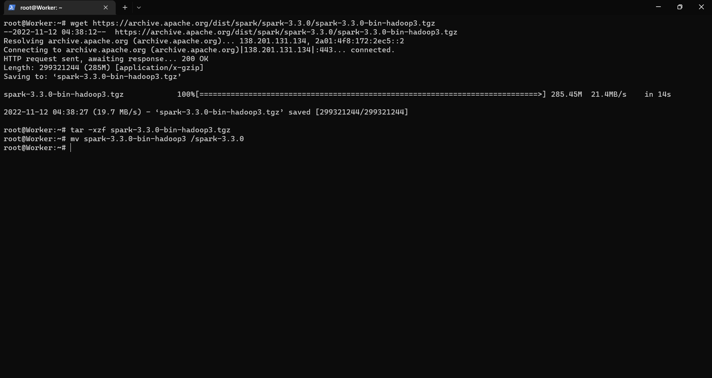
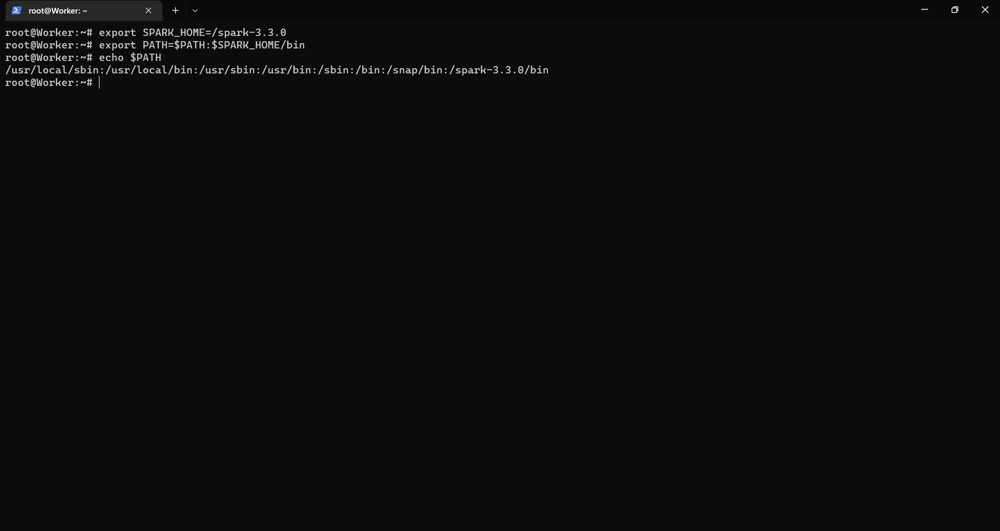
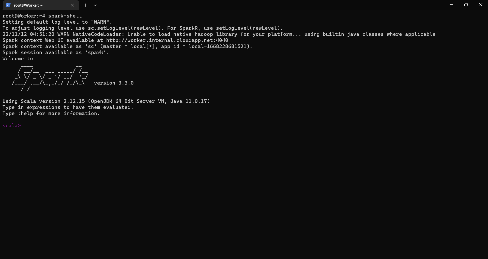

# Installation of Apache Spark
Follow up the step carefully to install Apache spark in Ubuntu. 
I personally recommend to work with linux environment especially Ubuntu.
### step 1 - update your system.
~~~
apt-get update.
~~~

### step 2 - Java installation.
A JDK is required for Spark to run. I'm using JDK 11 you can install your preferred version.
~~~
apt-get install openjdk-11-jdk
~~~
check if Java installed.
~~~
java -version
~~~

### step 3 - Download and extract Spark.
I'm going to use Spark 3.3.0 with Hadoop 3. 
You can download the latest stable version which was released at the time of you reading this documentation.
~~~
wget https://archive.apache.org/dist/spark/spark-3.3.0/spark-3.3.0-bin-hadoop3.tgz
tar -xzf spark-3.3.0-bin-hadoop3.tgz
mv spark-3.3.0-bin-hadoop3 /spark-3.3.0
~~~

### step 4 - Setting path.
In order to use spark commands from anywhere you need to set path variables
~~~
export SPARK_HOME=/spark-3.3.0
export PATH=$PATH:$SPARK_HOME/bin
~~~

### step 5 - verification of Spark installation.
To verify the correct installation of spark. you can run spark shell.
~~~
spark-shell
~~~
upon successful installation the screen will look like this.
