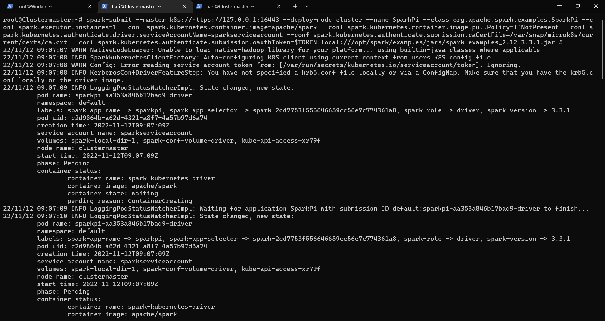
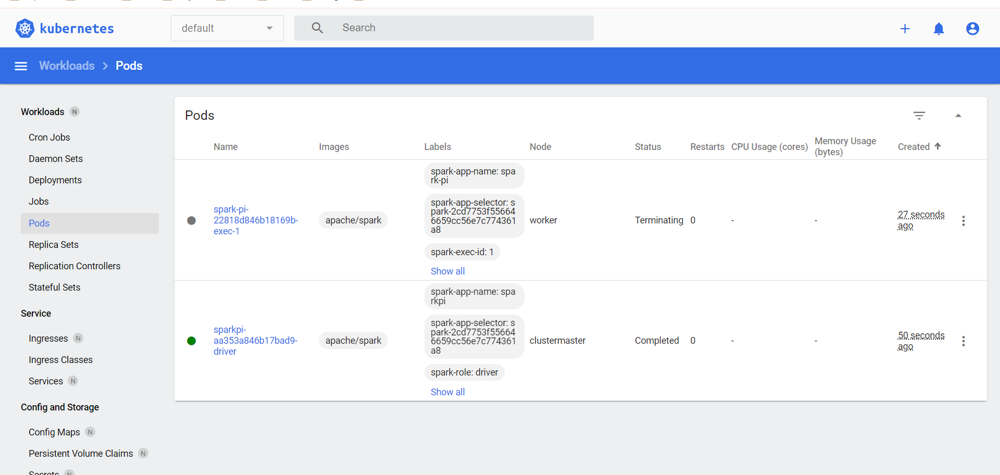

# Running Spark Jobs
To explain how to run spark job I chose SparkPi example which comes with Spark itself.
There are many examples like SparkPi bundled with Spark that are available under examples directory of Spark.

## Running Spark jobs in standalone cluster
Once you installed Apache Spark successfully you can be able to submit job to Spark.
If you haven't installed Spark. [check out here.](../Installation%20of%20spark/installation_of_spark.md)

### command to submit job
~~~
spark-submit --master local[*] \
 --name SparkPi --class org.apache.spark.examples.SparkPi \
 /spark-3.3.0/examples/jars/spark-examples_2.12-3.3.0.jar 5
~~~

### master url explanation
| url                      | explanation                                                                                           |
|:-------------------------|:------------------------------------------------------------------------------------------------------|
| local                    | runs spark jobs locally with single worker thread.                                                    |
| local[n]                 | runs spark jobs locally with n workers. Usually n can be number matching no. of cores in the machine. |
| local[*]                 | runs spark jobs locally with as many worker as the logical cores in your system.                      |
| spark://<127.0.0.1:7077> | runs spark jobs in remote master. note replace <127.0.0.1:7077> with your remote master url.          |

## Running Spark jobs in Kubernetes cluster
Once you set kubernetes cluster you can be able to submit spark job to kubernetes.
If you haven't set up kubernetes cluster yet. [check out here](../kubernetes%20cluster%20setup/microk8s_cluster_setup.md)

### command to submit job

~~~
spark-submit \
--master k8s://https://127.0.0.1:16443 \
--deploy-mode cluster \
--name SparkPi \
--class org.apache.spark.examples.SparkPi \ 
--conf spark.executor.instances=1 \
--conf spark.kubernetes.container.image=apache/spark \
--conf spark.kubernetes.container.image.pullPolicy=IfNotPresent \
--conf spark.kubernetes.authenticate.driver.serviceAccountName=sparkserviceaccount \
--conf spark.kubernetes.authenticate.submission.caCertFile=/var/snap/microk8s/current/certs/ca.crt \
--conf spark.kubernetes.authenticate.submission.oauthToken=$TOKEN \
local:///opt/spark/examples/jars/spark-examples_2.12-3.3.1.jar 5
~~~

You can also see your application in kubernetes dashboard

