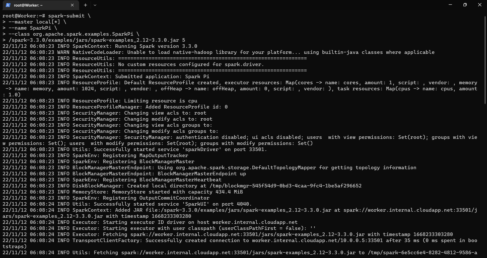

# Running Spark Jobs
To explain how to run spark job I chose SparkPi example which comes with Spark itself.
There are many examples like SparkPi bundled with Spark that are available under examples directory of Spark.

## Running Spark Jobs in standalone cluster
Once you installed Apache Spark successfully you can be able to submit job to Spark.
If you haven't installed Spark. [check out here.](https://github.com/hariharasudhan006/Spark-Guide-for-Java/blob/433378f82db423b91a28ca7f8f3fabf9cca15bbb/Documentations/Installation%20of%20spark/installation_of_spark.md)

### command to submit job
~~~
spark-submit --master local[*] \
 --name SparkPi --class org.apache.spark.examples.SparkPi \
 /spark-3.3.0/examples/jars/spark-examples_2.12-3.3.0.jar 5
~~~

### master url explanation
| url                  | explanation                                                                                           |
|:---------------------|:------------------------------------------------------------------------------------------------------|
| local                | runs spark jobs locally with single worker thread.                                                    |
| local[n]             | runs spark jobs locally with n workers. Usually n can be number matching no. of cores in the machine. |
| local[*]             | runs spark jobs locally with as many worker as the logical cores in your system.                      |
| spark://host-ip:port | runs spark jobs in remote master.                                                                     |