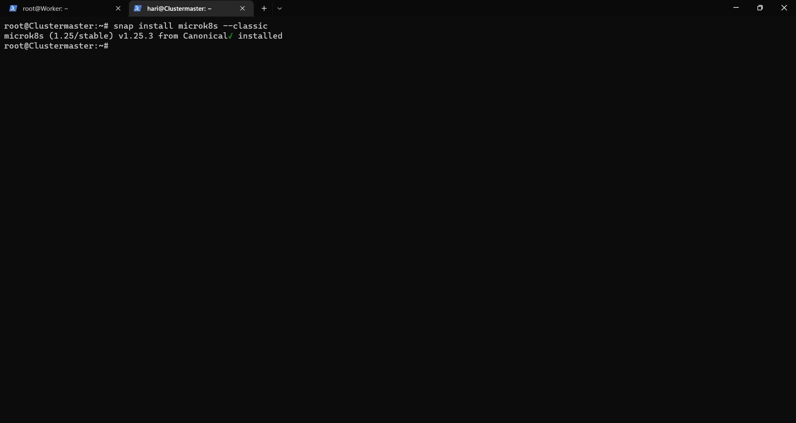
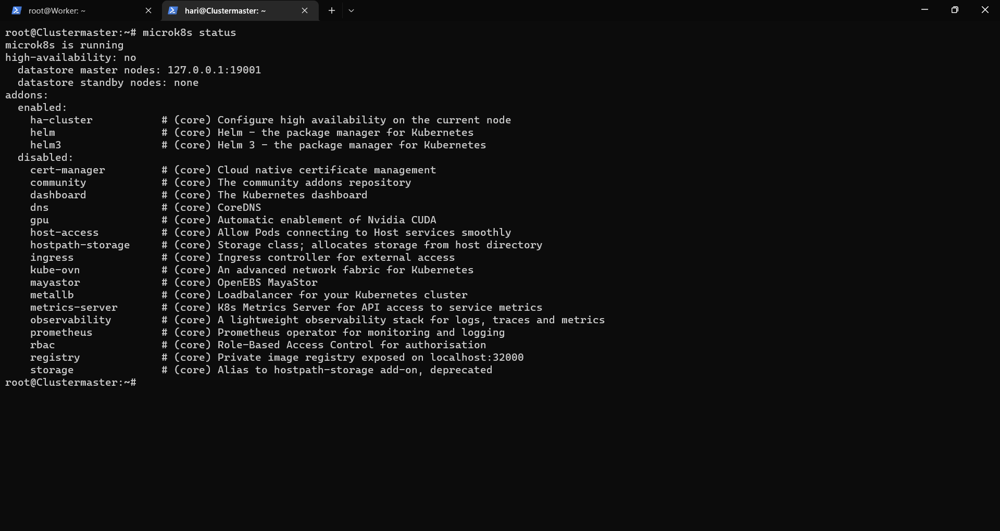
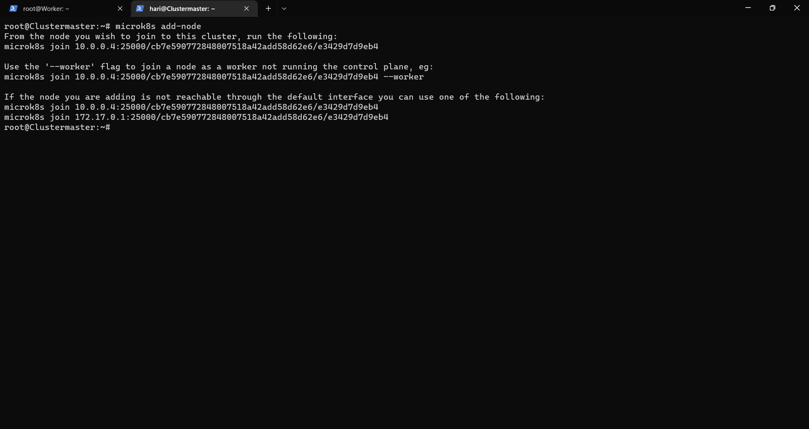
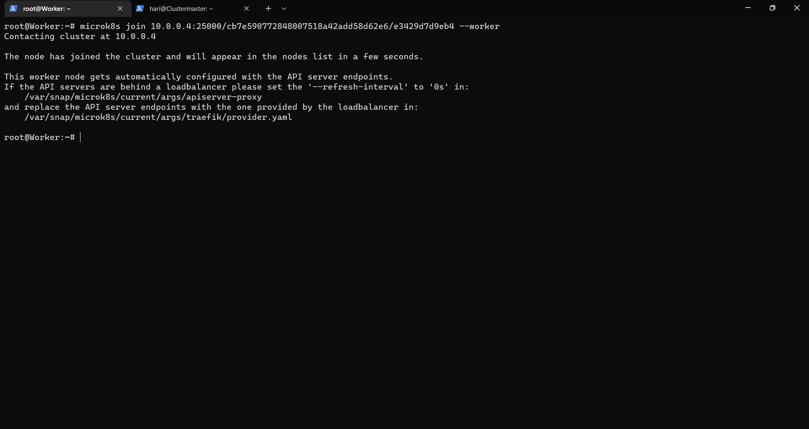
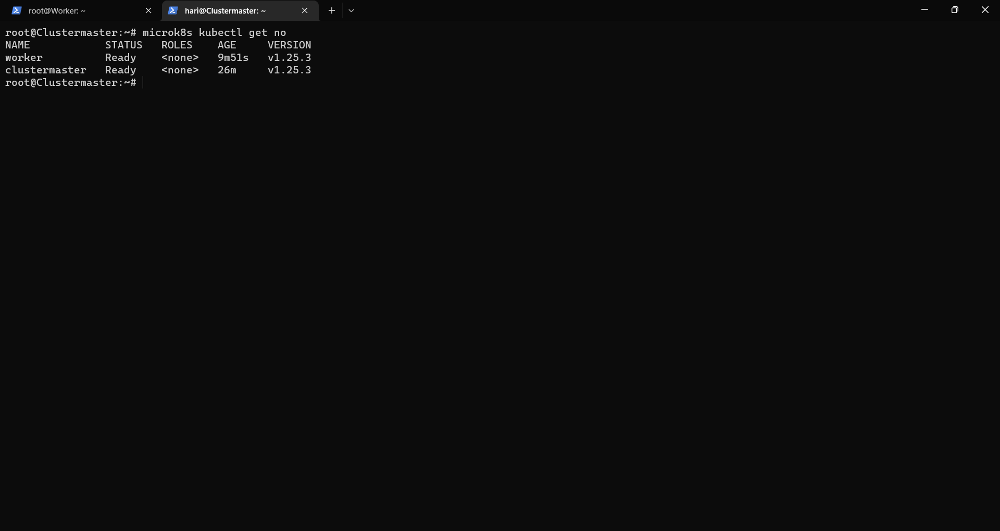
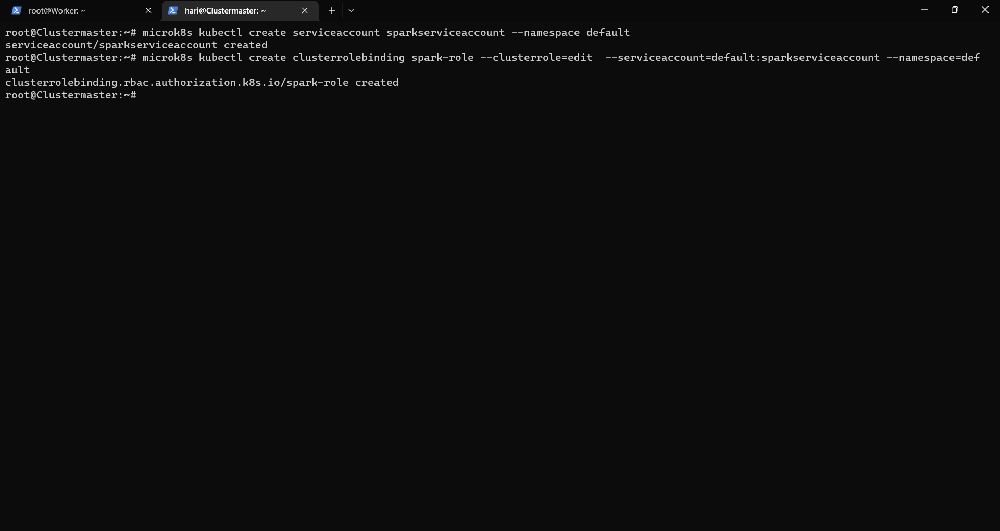
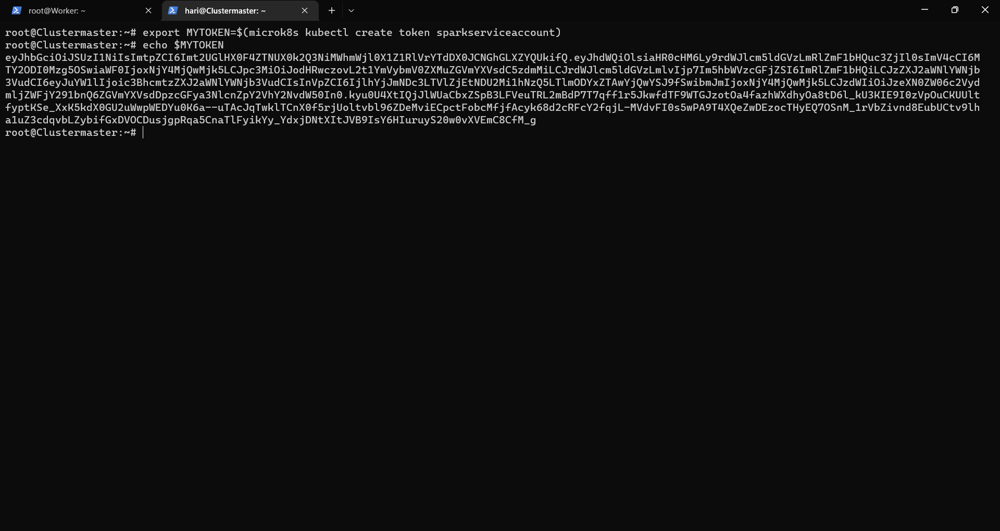
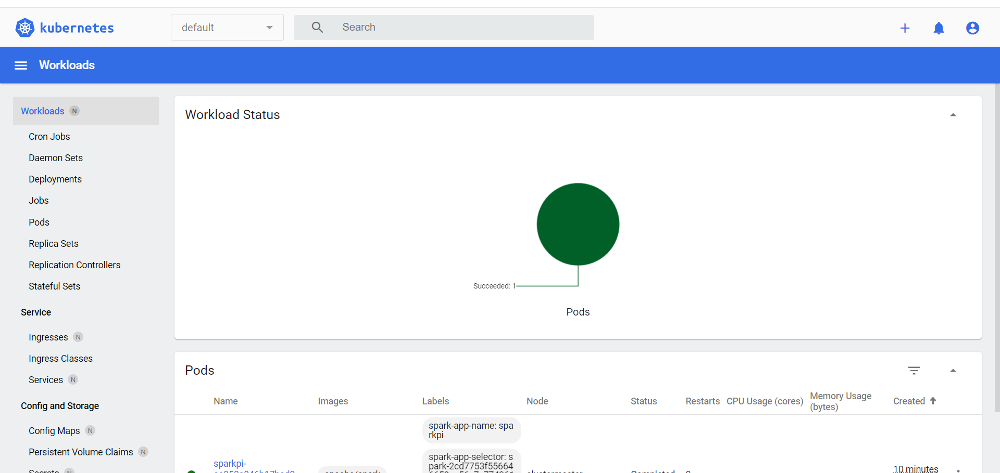

# microk8s cluster setup
carefully follow the below steps to set up microk8s cluster.
MicroK8s is a powerful, lightweight, reliable production-ready Kubernetes distribution.
### step 1 - install microk8s.
Do this step in every node which you wish to make it as cluster. suppose, if you want to make cluster with 2 nodes.
do this step in both the nodes.

#### before any installation do update.
~~~
apt-get update
~~~

#### command to install microk8s.
~~~
snap install microk8s --classic
~~~

#### command to check status.
you can check the status of microk8s by running the following command
~~~
microk8s status
~~~

if the command shows not running use the following command
~~~
microk8s status --wait-ready
~~~
this command will wait until the microk8s status comes to running.
if the above command stuck and waiting forever do uninstall microk8s and reinstall.

#### adding workers host name to master
Do this step only in node which want to be your cluster master. don't do this all nodes.
To add the workers to cluster the master must know their addresses.
~~~
echo "<replace-worker-ip> <replace-worker-hostname>" >> /etc/hosts
~~~
do this for every worker you want to add.

#### command to make cluster
Do this step only in node which want to be your cluster master. don't do this all nodes.

~~~
microk8s add-node
~~~

above command will be print 3 commands copy the second command and paste in your worker node.
if you want to add another node run the above command again and copy the second command and paste in your next worker.

**Note: Do not paste the same join command in more than one worker. it won't work.**
**Note: Do not add nodes with same name. each worker should be with unique name**

#### command to show nodes in the cluster.
~~~
microk8s kubectl get no
~~~

**Note: the above command only works in cluster master**

Now we are having a kubernetes cluster. To run spark application in kubernetes cluster we need a service account.

#### to create service account.
run the below command to create a service account.

~~~
microk8s kubectl create serviceaccount sparkserviceaccount --namespace default
microk8s kubectl create clusterrolebinding spark-role --clusterrole=edit  --serviceaccount=default:sparkserviceaccount --namespace=default
~~~

**Note: sparkserviceaccount is an account name you can specify your own. And this account name for running spark jobs.**

#### to create token for service account.

authentication is need to run spark jobs.

~~~
export MYTOKEN=$(microk8s kubectl create token sparkserviceaccount)
~~~

you can see and manage kubernetes cluster accessing kubernetes dashboard

~~~
microk8s dashboard-proxy
~~~

the above command will print a token copy the token which is required when logging in into dashboard.

